# Microcontroller-Smartwatch
 A WiFi-enabled, MCU driven smartwatch with environmental sensors and LiPO charging and protection circuits. It is built around the ATSAMD21G18A microcontroller.

# Initial Planning
  The original objective was to create a basic smartwatch with a standalone MCU, LCD screen, wifi capabilities, and various sensors. The ATSAMD21G18A was selected as the foundation of the project due to its excellent memory, high processing speed, low power consumption, small size, and versitility. The Nina-W102 was selected as the wifi module because of its ease of use and wealth of documentation. The other components were selected because they also had much supporting information to aid in their use.
  
-  [MCU (ATSAMD21G18A)](https://cdn.sparkfun.com/datasheets/Dev/Arduino/Boards/Atmel-42181-SAM-D21_Datasheet.pdf)
-  [WiFi Module (Nina-W102)](https://content.u-blox.com/sites/default/files/NINA-W10_DataSheet_UBX-17065507.pdf)
-  [Sensor Module (MS8607-02BA01)](https://www.te.com/commerce/DocumentDelivery/DDEController?Action=showdoc&DocId=Data+Sheet%7FMS8607-02BA01%7FB3%7Fpdf%7FEnglish%7FENG_DS_MS8607-02BA01_B3.pdf%7FCAT-BLPS0018)
-  OLED Screen (SH1106I2C)
    - Generic Breakout Board
-  [LiPO Protection IC (FS312F-G)](https://pdf1.alldatasheet.com/datasheet-pdf/view/1132811/FORTUNE/FS312F-G.html)
-  [LiPO Charge IC (TP4056)](https://dlnmh9ip6v2uc.cloudfront.net/datasheets/Prototyping/TP4056.pdf)
-  [Power Supply IC (MT3608)](https://www.olimex.com/Products/Breadboarding/BB-PWR-3608/resources/MT3608.pdf)

# First Prototype
 Drawings were made of each components and its respective connections. 
<figure>
    <figcaption>Microcontroller</figcaption>
    
</figure>

<figure>
    <figcaption>Wifi Module</figcaption>
    
</figure>

<figure>
    <figcaption>Sensor Module</figcaption>
    
</figure>

<figure>
    <figcaption>OLED Screen</figcaption>
    
</figure>

<figure>
    <figcaption>LiPO ICs</figcaption>
    
</figure>

 An initial prototype was then constructed on a solderless breadboard. Various breakout boards, a TQFP chip adapter, and a basic LD33V power supply were used. Code for a clock, stopwatch, timer, the sensors, and wifi module was developed.
<figure>
    <figcaption>Design on Breadboard</figcaption>
    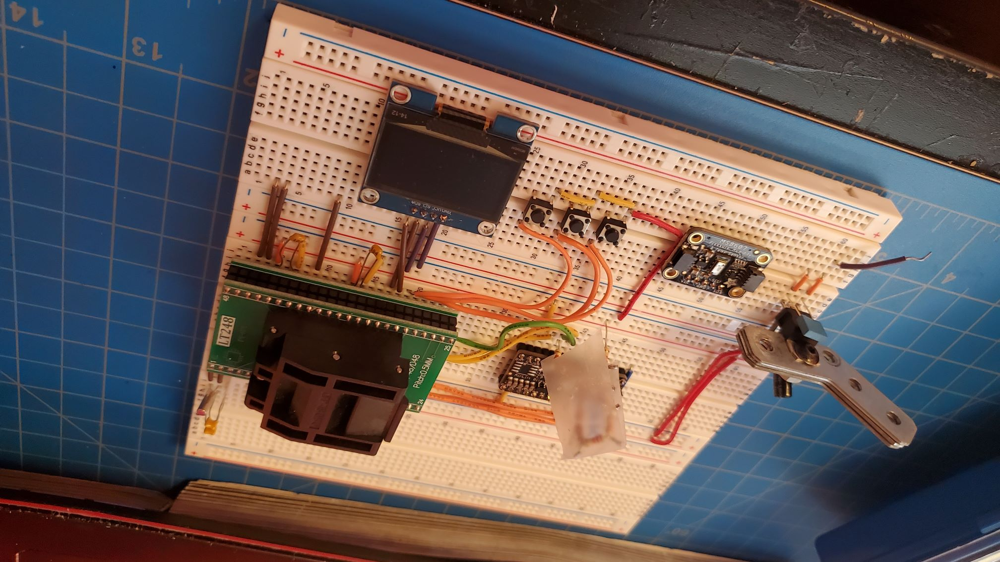
</figure>
 
 The first prototype had numerous problems, mainly caused by the poor connections between the breadboard plates and the component legs. This resulted in a very unreliable supply of current and voltage as some connections, in parallel in series respectively, were barely touching and provided high resistance. Ultimately, this caused the malfunction of the wifi module, which required a high current and stable voltage. The components were all soldered onto perfboard to fix this. As can be seen, the wifi module problem was rectified.
<figure>
    <figcaption>Design on Perfboard</figcaption>
    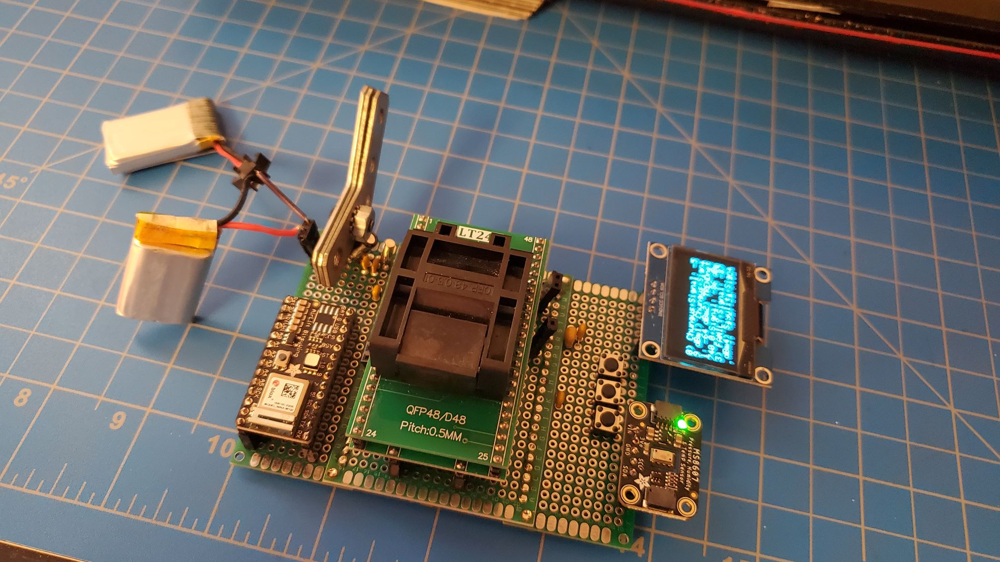
</figure>

All modules now functioned and software development would continue on a second prototype.

# Second Prototype

First, a proper schematic was drawn.
<figure>
    <figcaption>Schematic 2</figcaption>
    
</figure>

Next, a PCB was designed. It was double-sided because there was not enough space to route all connections on one side. Spaces were left to screw on the OLED screen and insert a standard NATO watch strap.
<figure>
    <figcaption>PCB 2</figcaption>
    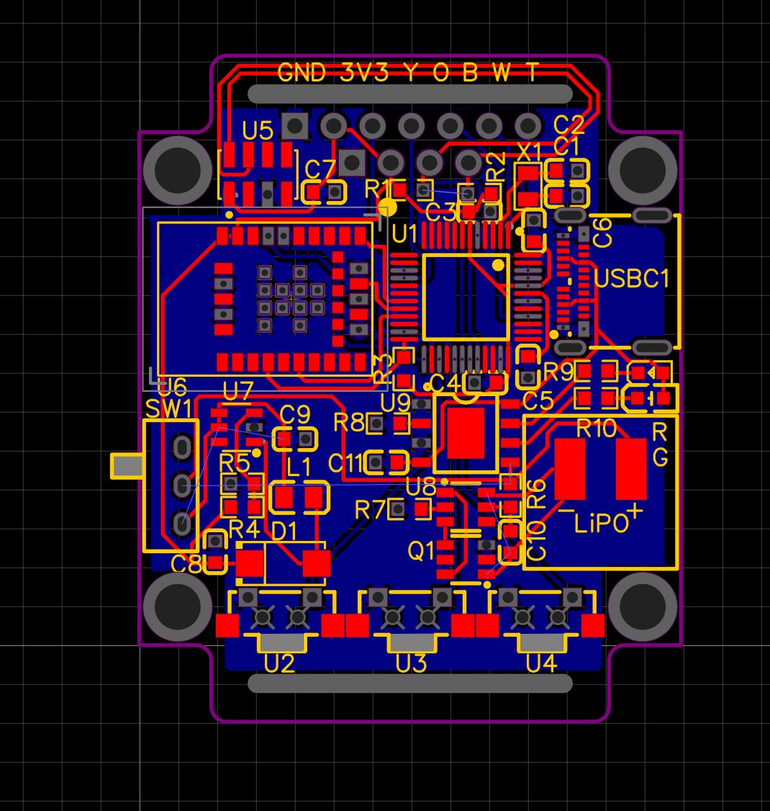
</figure>

All components, the PCB, and the stencil were then purchased. 

The stencil was cut, placed over one of the PCBs, and then solder paste applied overtop of it.
<figure>
    <figcaption>Stencil and Solder Paste</figcaption>
    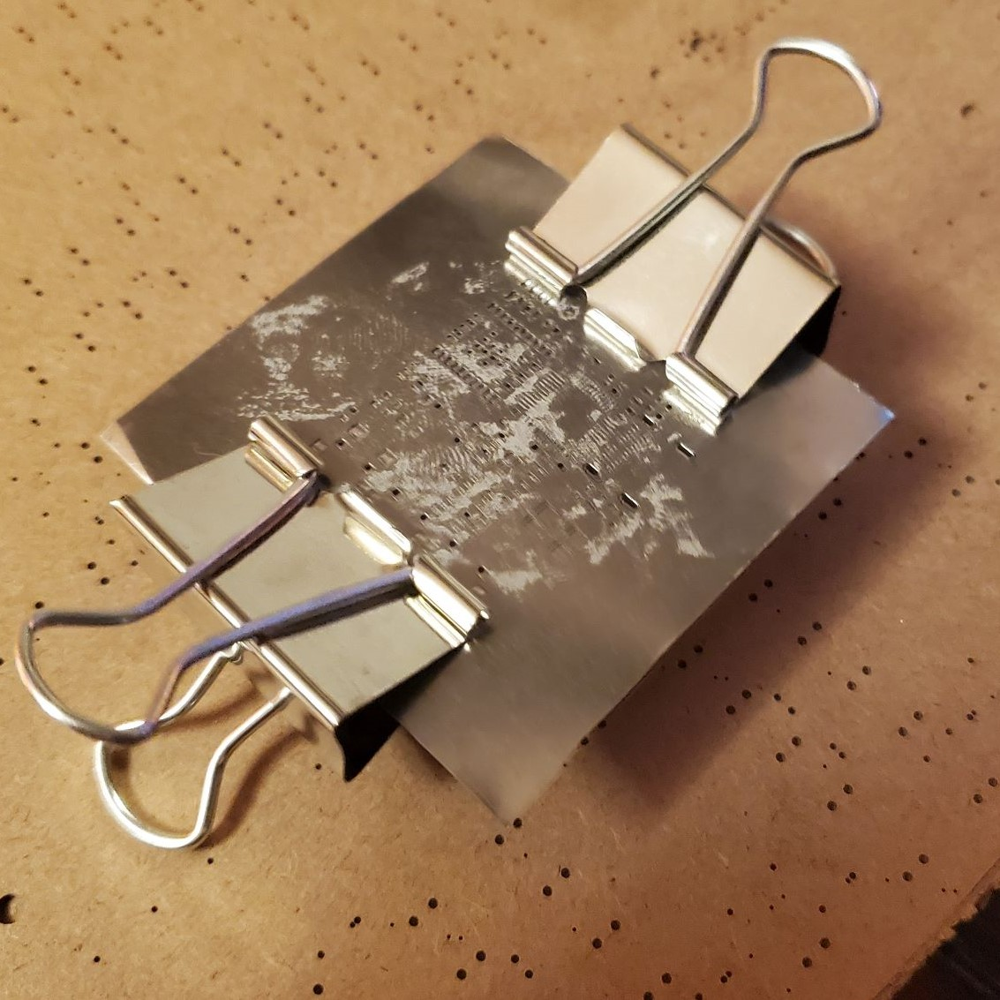
</figure>

All SMD components were then placed on the board. The solder paste was reflowed via bottom heating. A pot with sand in it, used to evenly disperse heat, was used for bottom heating.
<figure>
    <figcaption>Bottom Heating</figcaption>
    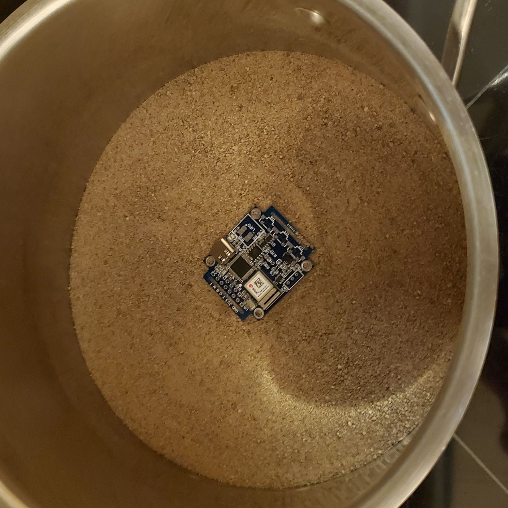
</figure>

The remaining THT components and the battery were then soldered to the board using a soldering iron.
<figure>
    <figcaption>Second Prototype, First Iteration</figcaption>
    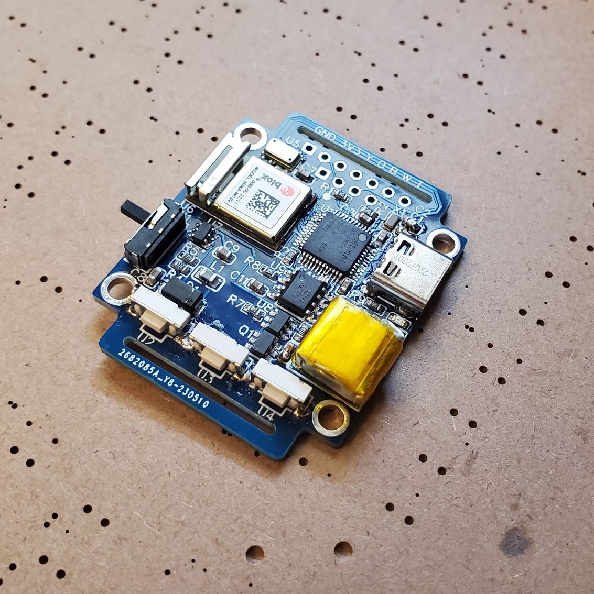
</figure>

The OLED screen was then soldered atop the board, but did not display anything when the circuit was powered through the battery or an external 3.3 volts. The MCU was pre-programmed in this instance, but it could not be detected by the IDE while soldered onto the board. Clearly, there was a big problem with the circuit. Every part of the design was reviewed and another blank PCB probed. The following potential causes were identified:

- PCB Stencil was initially not properly secured to the PCB, leading to improper solder paste application, so the new attachment method in the above picture was devised. The stencil was not properly cleaned before this second application, though, and some holes were blocked by old paste. This may have lead to improper application.
- Too much sand was used in the bottom-heating process. This was due to the excessive heat-up time, during which the MCU may have broken.
- When the reflow was complete, several components did not have enough solder connecting them to the board. The long heat-up time also lead to the flux in the solder paste burning off completely. This lead to extensive rework and possible damage of the MCU.

Ultimately, it was concluded that improper assembley left the circuit inoperable. This was fixed in a second assembley of the PCB, in which the MCU was detected by the IDE.
<figure>
    <figcaption>Second Prototype, Second Iteration</figcaption>
    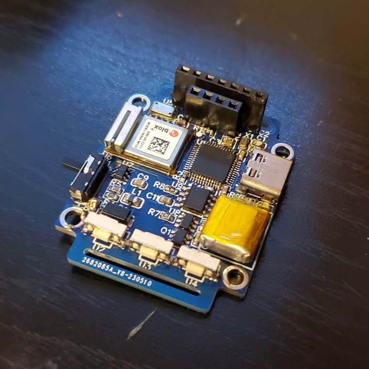
</figure>

The OLED, however, still did not display anything when connected and powered. At this point, research was conducted to identify more possible causes of the continuing problem. The following potential causes were identified:

- Unused inputs on the MCU were left floating, likely causing them to pick up interfering signals and disrupt the MCU's clock speed. This was not a problem on the first prototype since all of the components were spaced out, but was thought to be a problem on the second one due the closer proximity of the components. For example, there were several capacitors near unconnected pins and their electric fields could have caused the problem. There were also the unshielded charging/protecting ICs that also involved rapidly changing electric fields.
    - [Source: altium.com](https://resources.altium.com/p/what-do-unused-pins-microcontroller)
    - [Source: instructables.com](https://www.instructables.com/7-reasons-Your-Circuit-Isnt-Working/)
- There were several excessively-long signal traces on the PCB. In addition to potentially picking up unwanted signals, they could have been capacitively coupled to a degree that interfered too much with their signals.
    - [Source: camptechii.com](https://camptechii.com/improve-your-pcb-design-and-reduce-manufacturing-headaches-with-these-18-pcb-layout-tips/)
- The decoupling capacitors were placed incorrectly.
    - [Source: Image](https://i.stack.imgur.com/rRCDN.png)
- The programming ports and reset pin on the MCU did not have pullup resistors and had fairly long programming wires, which could have lead to them picking up signals and resetting the MCU unintentionally.

Some less-critical issues were also found:

- The battery was not referenced to the ground of the entire circuit due to a misunderstanding of the example circuit on the datasheet. This would have caused problems when the power source was switched from test leads to the battery.
- The LiPO protection IC's exposed pad was not grounded, as specified on the datasheet.
- The step-up converter IC was accompanied by the lowest-value reccommended inductor specified by the datasheet. With the wifi module demanding a peak of five-hundred milliamps at three point three volts, this may have lead to inductor saturation.
- The pin that activated the step-up converter IC was not connected to 3.3 volts, meaning it was not activated.

 The identified issues were resolved and additional research on general PCB assembley was also conducted to improve the next design. A simple voltage checker was also implemented to estimate the charge of the battery.

# Third Prototype

The schematic of the third prototype was organised much more effectively than the previous ones.
<figure>
    <figcaption>Schematic 3</figcaption>
    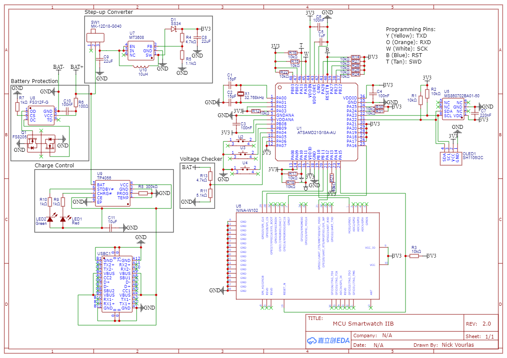
</figure>

<figure>
    <figcaption>PCB 3</figcaption>
    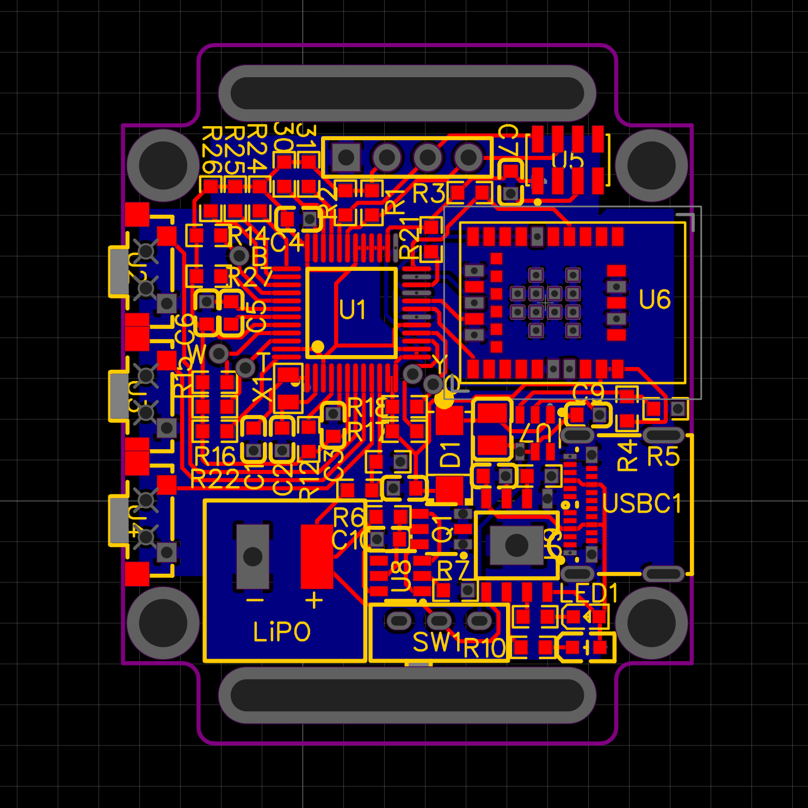
</figure>

<figure>
    <figcaption>Third Prototype, After Rework</figcaption>
    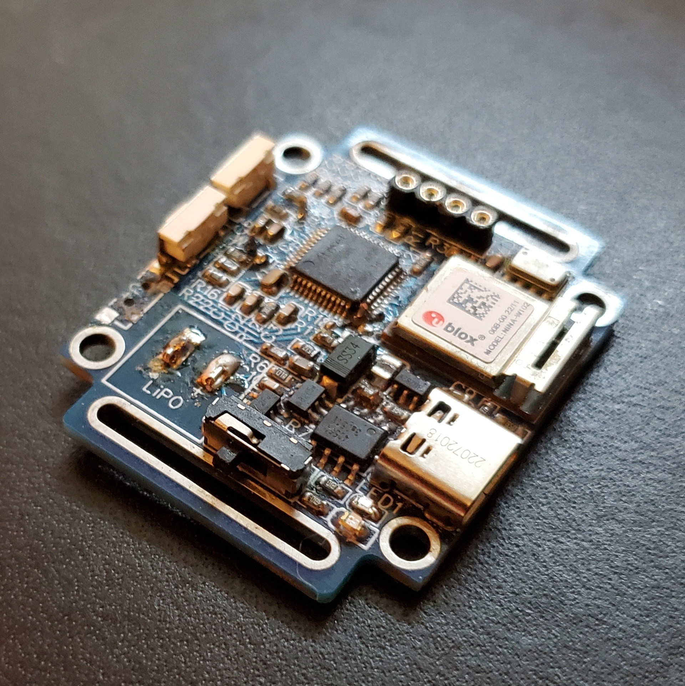
</figure>

On this version, the OLED still did not power on, and therefore the functionality of the wifi and sensor modules could not be discerned. Much rework was done on the board and several points of error were identified:
- The inductor was getting hotter than a scramjet combustion chamber, even burning away the risidual flux around it. An inductor with a lower DC resistance was needed.
- A step-up convertor was used, whereas a [buck-boost convertor](https://www.lcsc.com/datasheet/lcsc_datasheet_1809200040_Texas-Instruments-TPS63020DSJR_C15483.pdf) was needed. This lead to an inadequate power supply.
- Holes were made through the pads, even the very small ones, as opposed to using descrete vias. The holes made improper solder joints more likely.
- There was no power plane and the ground plane did not conform to the entirety of the board, potentially leading to interference. It would be far better to simply use a four-layered board.
    - [Source: Image](Images/gnd and vcc planes.jpg)
- Several of the board's metal reinforcements were not grounded and may have caused excessive impedence.
- The MCU programming holes were really shoddy and disorganised, which greatly slowed development. A robust system was needed.
- Several decoupling capacitors for the wifi module were missing due to a misunderstanding of the example schematic.
    - [Source: Image](https://cdn-learn.adafruit.com/assets/assets/000/080/457/original/adafruit_products_schematic.png?1567623352)
- For the charging USB, all of the 5V input lines were connected and used, while only one was neccessary. Given the somewhat-messy reflow soldering and that several pads were hidden under the USB, it was better to remove the suspicion of an unintentional solder bridge by only using one.

Some less-critical issues were also found:
- The trace routing was still sloppy. Better use of the bottom plane was required for shorter, cleaner traces.
- The silkscreen lettering of each component's I.D. looked messy and may have confused component placement. On such a small and relatively simple board it could be done away with entirely.
- The resistor on the LiPO charging subcircuit had too high a value (300k) and would have lead to excessive charging times. It was replaced with a 10k.

# Final Version

<figure>
    <figcaption>Final Schematic</figcaption>
    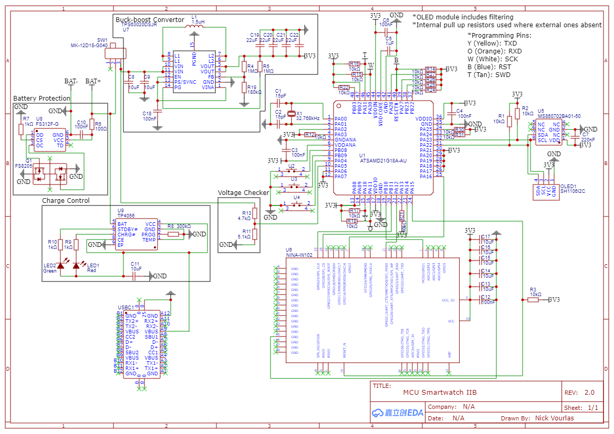
</figure>

<figure>
    <figcaption>Final PCB</figcaption>
    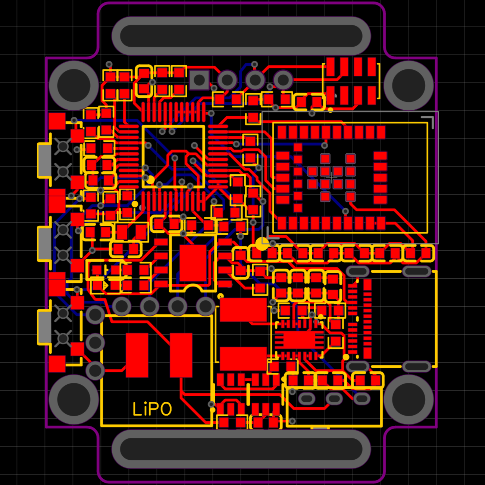
</figure>

<figure>
    <figcaption>Final Version (Without OLED and Hardware)</figcaption>
    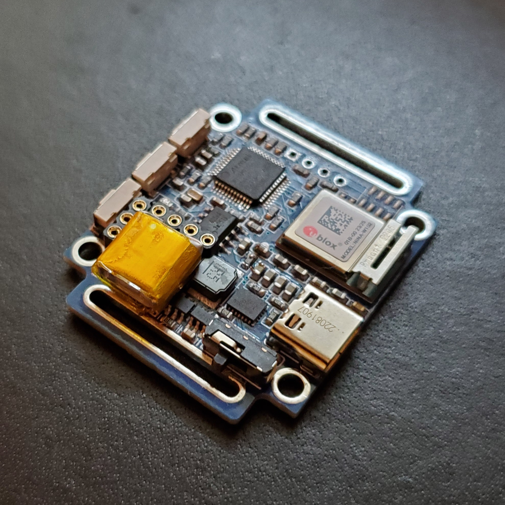
</figure>

[Picture with hardware and turned on]

Several important changes were made in the final version; namely, the bootloader was uploaded to the stock MCU! This is why it did not work before. I'm entitled to a few stupid mistakes. The code was also completely overhauled to be much more efficient. No more sensor modules remained, so it was omitted from this version. All standard watch fucntions (clock, timer, stopwatch) worked well. The wifi module caused the MCU to freeze or display a static screen whenever on of its functions was called, likely due to improper connections. However, even with the shortcomings of several intended features, a viable product was finally produced after almost two years of work.

# Conclusions

This project encountered many setbacks but proved to be an invaluable learning experience. Areas such as basic electrics, electronics, microcontrollers, programming, PCB design and assembly, troubleshooting, and product development were explored in great detail. 
