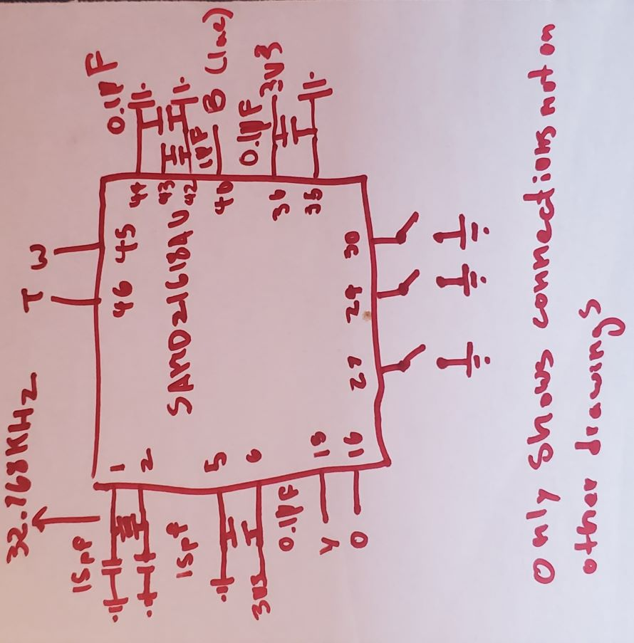
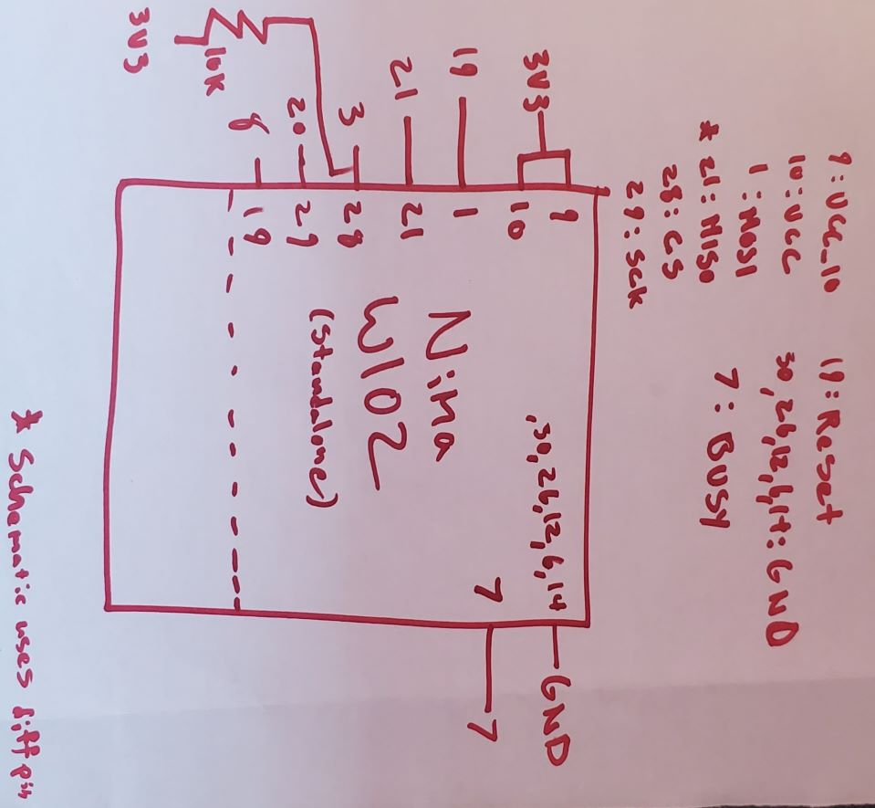
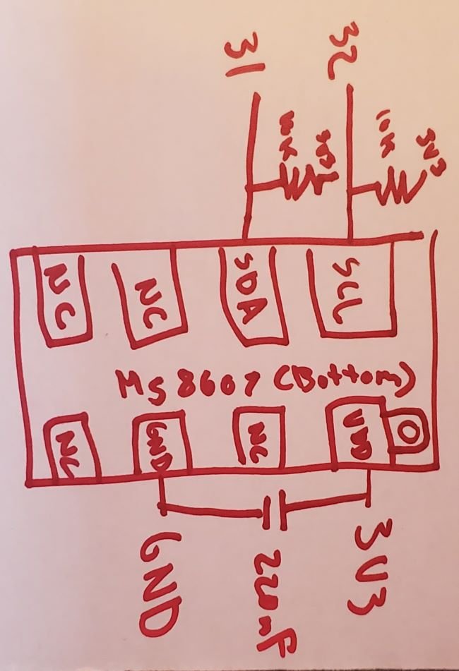
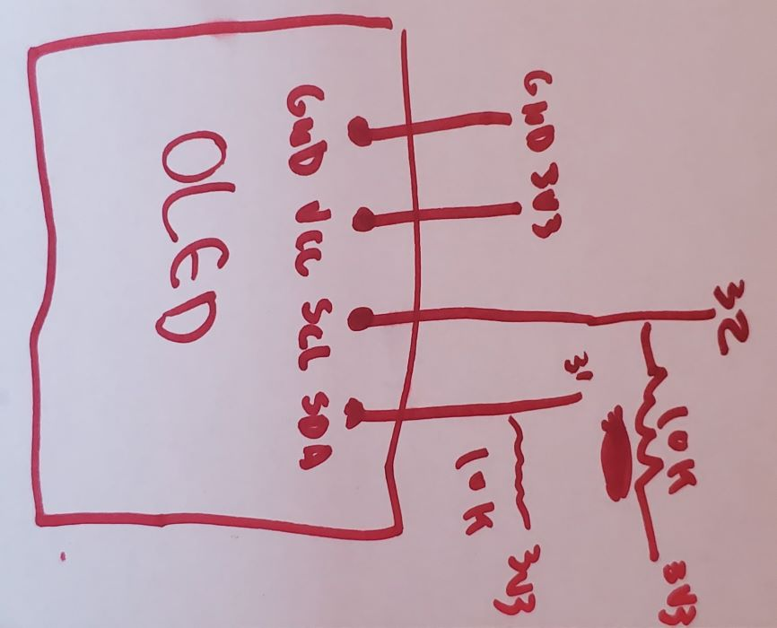
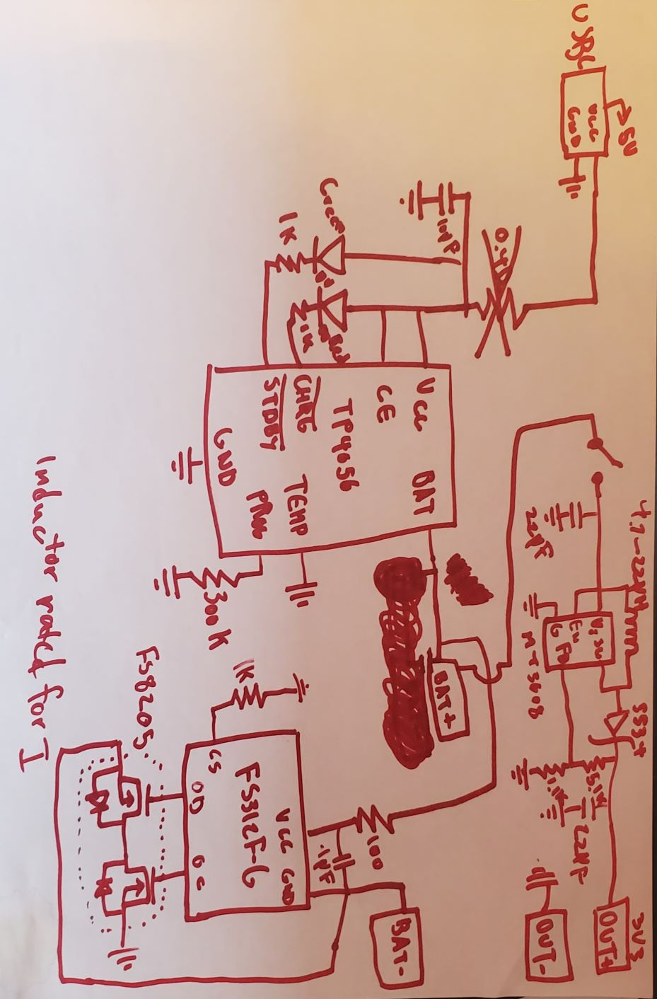

# Microcontroller-Smartwatch
 A WiFi-enabled, MCU driven smartwatch with environmental sensors and LiPO charging and protection circuits. It is built around the ATSAMD21G18A microcontroller.

# Initial Planning
  The original objective was to create a basic smartwatch with a standalone MCU, LCD screen, wifi capabilities, and various sensors. The ATSAMD21G18A was selected as the foundation of the project due to its excellent memory, high processing speed, low power consumption, small size, and versitility. The Nina-W102 was selected as the wifi module because of its ease of use and wealth of documentation. The other components were selected because they also had much supporting information to aid in their use.
  
-  [MCU (ATSAMD21G18A)](https://cdn.sparkfun.com/datasheets/Dev/Arduino/Boards/Atmel-42181-SAM-D21_Datasheet.pdf)
-  [WiFi Module (Nina-W102)](https://content.u-blox.com/sites/default/files/NINA-W10_DataSheet_UBX-17065507.pdf)
-  [Sensor Module (MS8607-02BA01)](https://www.te.com/commerce/DocumentDelivery/DDEController?Action=showdoc&DocId=Data+Sheet%7FMS8607-02BA01%7FB3%7Fpdf%7FEnglish%7FENG_DS_MS8607-02BA01_B3.pdf%7FCAT-BLPS0018)
-  OLED Screen (SH1106I2C)
-  [LiPO Protection IC (FS312F-G)](https://pdf1.alldatasheet.com/datasheet-pdf/view/1132811/FORTUNE/FS312F-G.html)
-  [LiPO Charge IC (TP4056)](https://dlnmh9ip6v2uc.cloudfront.net/datasheets/Prototyping/TP4056.pdf)
-  [Power Supply IC (MT3608)](https://www.olimex.com/Products/Breadboarding/BB-PWR-3608/resources/MT3608.pdf)

# First Prototype
 Drawing were made of each components and its respective connections. 
<figure>
    
    <figcaption>Microcontroller</figcaption>
</figure>

<figure>
    
    <figcaption>Wifi Module</figcaption>
</figure>

figure>
    
    <figcaption>Sensor Module</figcaption>
</figure>

figure>
    
    <figcaption>OLED Screen</figcaption>
</figure>

figure>
    
    <figcaption>LiPO ICs</figcaption>
</figure>

